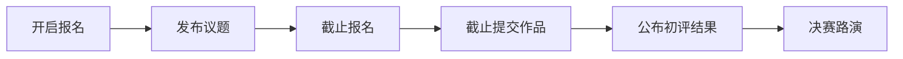

# dev-talent-ranker

https://www.qiniu.com/activity/detail/66cfe17084a4441c29b08be9?001

## 开发思路

根据 `GitHub` 的开源项目数据，开发一款开发者评估应用。

### 1.要求

#### （1）基础功能（必须实现）

- 开发者在技术能力方面 `TalentRank`（类似 `Google` 搜索的 `PageRank`），对开发者的技术能力进行评价/评级。评价/评级依据至少包含：项目的重要程度、该开发者在该项目中的贡献度。
- 开发者的 Nation。有些开发者的 Profile 里面没有写明自己的所属国家/地区。在没有该信息时，可以通过其关系网络猜测其 Nation，`Nation` 作为可选的筛选项，比如只需要显示所有位于中国的开发者。
- 开发者的领域，如所使用语言，可根据领域搜索匹配，并按 `TalentRank` 排序。

#### （2）高级功能（可选实现）

- 所有猜测的数据，应该有置信度。置信度低的数据在界面展示为 `N/A` 值。
- 开发者技术能力评估数据多模态提取，评估数据可能来自评论文本、开发者博客等，可以借助这些信息丰富数据集——提取思路借助大模型。

> 有的开发者在 `GitHub` 上有博客链接，甚至有一些用 `GitHub` 搭建的网站，也有一些在 `GitHub` 本身有账号相关介绍。可基于类 `ChatGPT` 的应用整理出开发者评估信息。

#### （3）实现要求

与开发者能力评估相关部分功能实现，鼓励创新。其他技术方面允许使用现成的源代码或云服务，如**数据采集框架**、**云计算**、**大模型服务**等。

截止时间：`2024 年 11 月 07 日 23:59`。

提交方式：将**产品所有源代码**、如何**运行程序的说明**、**架构设计文档（包含模块规格、分工）**、录制的 `demo` 视频上传至 `GitHub`、`Gitee` 或其他开源协作平台。
组队参赛情况下，代码仓库需要有多人代码提交记录。如果代码仓库只有一个人提交代码的痕迹，将视为非团队作品。

> 代码仓库需要保留参赛期间内团队协同创作的所有痕迹。只在最后一天一次性提交代码亦视为不合格，将取消参赛资格。

#### （4）补充说明

除另行说明，参赛作品的知识产权归参赛队所有。

参赛队伍/选手应自觉遵守知识产权的有关法规，不得侵犯他人的知识产权或其他权益，不得未经相关单位许可对外共享或公开发布涉及该单位知识产权的作品及软件。 如造成不良后果，相关法律责任由参赛队自行承担，大赛的主办、承办和协办方均不负任何法律责任。

参赛队伍/选手应保证学术诚信。一经确认代码抄袭或技术抄袭等学术不端行为，或代码重复率在 `50%` 以上，将取消参赛资格，并列入赛事黑名单。

大赛报名者默认同意大赛的主办方公开赛道参赛作品源代码。大赛主办方拥有免费使用参赛作品进行演示和出版的权利（不涉及技术细节）。 如果以盈利为目的使用参赛作品，需与参赛队协商，经参赛队同意后，签署有关对参赛作品使用的协议。



#### （6）评分规则

| 评分维度       | 占比 | 说明                                       |
| -------------- | ---- | ------------------------------------------ |
| 完成度、丰富度 | 50%  | 考察基础功能实现情况与挑战性目标的达成程   |
| 架构设计       | 30%  | 评估架构设计思路的清晰度以及整体设计的合理 |
| 代码风格       | 10%  | 注重代码的编写风格，关注其可复用性与可读   |
| 团队协作       | 10%  | 衡量分工合理性;单人参赛按各团队平均分计    |

### 2.开发思路

#### （1）gpt4-0建议开发过程

```python
任务描述：

拟根据 `GitHub` 的开源项目数据，开发一款开发者评估应用，目标用户为雇主或招聘者。基础功能包括：开发者在技术能力方面基于 `TalentRank`算法（类似于pagerank）评分，对开发者的技术能力进行评价/评级。评价/评级依据至少包含：项目的重要程度、该开发者在该项目中的贡献度；开发者的 Nation。有些开发者的 Profile 里面没有写明自己的所属国家/地区。在没有该信息时，可以通过其关系网络猜测其 Nation；开发者的领域。可根据领域搜索匹配，并按 `TalentRank` 排序。`Nation` 作为可选的筛选项，比如只需要显示所有位于中国的开发者。
高级功能包括： 所有猜测的数据，应该有置信度。开发者技术能力评估数据多模态提取，评估数据可能来自评论文本、开发者博客等，可以借助这些信息丰富数据集。

接下来，我将基于GitHub API抓取开源项目和开发者相关信息，我应该获取哪些数据？数据的时间区间？范围区间？建议如何划分
```

- 实现基础功能

```python
- 使用 GitHub API 收集项目和开发者的数据，包括项目重要程度（如 star 数、fork 数）和开发者在项目中的贡献度（如提交次数、代码行数、issue 解决数等）。
- 利用项目的 star 数、fork 数、watch 数等指标，选择合适的算法评估项目的重要程度。
- 根据开发者提交次数、代码行数、开 / 关 issue 数等权重进行计算开发者的贡献度。
- 利用开发者之间的关联（如代码合作、项目参与等）计算开发者的 `TalentRank`（类似于`PageRank` 算法）。

#### 1.2 Nation 猜测

- **数据收集**：通过 GitHub API 获取开发者的 Profile 数据。
- **关系网络分析**：利用开发者的协作关系（如共同参与的项目、follow 关系等）进行关联分析，结合 IP 地址地理定位（若可用），通过机器学习算法猜测开发者的 Nation。

#### 1.3 开发者领域匹配及排序

- **领域分类**：通过分析开发者参与的项目及其使用的编程语言、标签等信息，确定开发者的领域。
- **搜索及排序**：允许用户输入领域关键词，按 TalentRank 对匹配的开发者进行排序，并提供 Nation 作为可选筛选项。
```


### 实现要求

- **数据采集**：可以使用现成的 GitHub API 进行数据采集，并结合其他开源数据采集框架。
- **算法实现**：可以利用现成的机器学习库（如 Scikit-learn、TensorFlow）实现相关猜测和置信度评估算法。
- **基础设施**：可以利用云计算平台（如 AWS、Google Cloud）进行数据处理和存储。
- **大模型服务**：可以调用现成的大语言模型 API（如 OpenAI 的 GPT-4 API）进行自然语言处理和信息整理。


## 一、项目概述

**项目简介：**DevTalent Ranker是一个基于GitHub开源项目数据的开发者能力评估平台。通过分析开发者在项目中的贡献度和项目的重要程度，我们为开发者提供技术能力的评级（TalentRank）。同时，平台能够推测开发者的所属国家（Nation）并支持按领域搜索匹配开发者，助力企业和社区发现和评价技术人才。

**项目目标：**

## 二、功能特点

- **排名算法**：详细描述用于对开发者进行排名的算法。例如，是基于代码质量、项目经验、技术广度和深度等多种因素的加权计算，还是其他独特的算法逻辑。
- **多维度评估**：列举出所评估的维度，像编程语言掌握程度、框架使用熟练度、问题解决能力、团队协作能力（如果有相关评估）等。
- **数据可视化（如果有）**：说明是否有可视化功能，如以图表形式展示开发者的排名趋势、各项能力的占比等，以及这些可视化是如何帮助用户理解数据的。

## 三、使用指南

- **用户角色（如果有多种）**：介绍项目涉及的不同用户角色，如管理员、普通开发者用户等。
- **注册 / 登录**：描述用户如何注册账号和登录系统。
- **输入数据（对于开发者用户）**：如果开发者需要输入自己的信息或项目经验等数据，详细说明输入的方式和要求。
- **查看排名和评估结果**：解释用户如何查看自己或其他开发者的排名和详细评估结果，包括界面上的操作步骤和可能的导航菜单。

## 四、技术栈

- 开发环境：`Pycharm` + `Vscode`
- 开发平台：可在 `windows`、`Linux`及 `mac` 操作系统上运行。
- 后端：`Django`+`Jinjia2`
- 前端：`Vue.js`
- 数据库：`MySQL 8.0` 
- 其他工具/技术：
- 外接`API`：
- **后端**：Node.js 或 Python（Flask/Django）进行 API 开发。
- **前端**：React 或 Vue.js 用于开发用户界面。
- **数据库**：MongoDB 或 PostgreSQL 用于存储开发者和项目数据。
- **机器学习**：Scikit-learn 用于实现基本的机器学习算法，TensorFlow 或 PyTorch 用于训练更复杂的模型。
- **NLP**：使用 OpenAI 的 GPT-4 API 进行自然语言处理和信息整理。

## 五、安装与运行

- **前提条件**：明确运行项目所需的环境和软件，如特定版本的 Node.js、Python 环境等，并给出安装这些前提条件的链接或简单步骤。
- **克隆仓库**：给出从 GitHub 克隆项目仓库的命令，如`git clone [项目仓库地址]`。
- **安装依赖**：对于后端和前端分别列出安装依赖的步骤。例如，对于 Python 后端可能是`pip install -r requirements.txt`，对于 JavaScript 前端可能是`npm install`或`yarn install`。
- **配置文件（如果有）**：说明是否需要配置文件，如果需要，详细解释配置文件中的各项参数，如数据库连接字符串、API 密钥等。

```python
pip install django jinja2
```

```python
# django-admin startproject devranker
cd devranker
python manage.py startapp talent_rank
python manage.py startapp developer_profile
python manage.py startapp analytics
```

|                     |                                          |
| ------------------- | ---------------------------------------- |
| `devranker`         | 项目配置和全局设置                       |
| `talent_rank`       | 处理TalentRank算法和评分                 |
| `developer_profile` | 处理开发者个人资料，包括国家、领域等信息 |
| `analytics`         | 数据分析，如项目重要程度分析             |

## 六、贡献指南


## 七、联系信息

有任何问题欢迎提Issue，或将问题描述发送至我邮箱 shelhen@163.com.我会尽快解答，推荐提交Issue方式。
